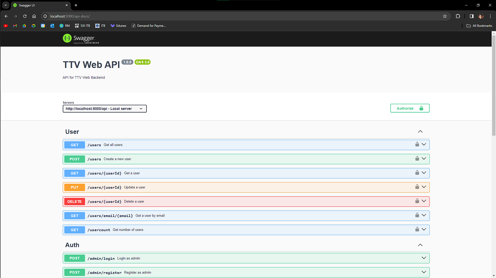
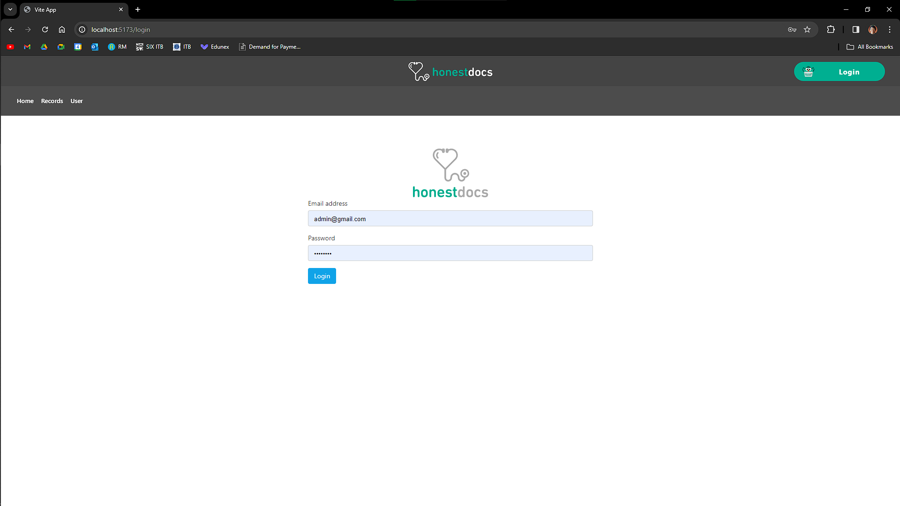
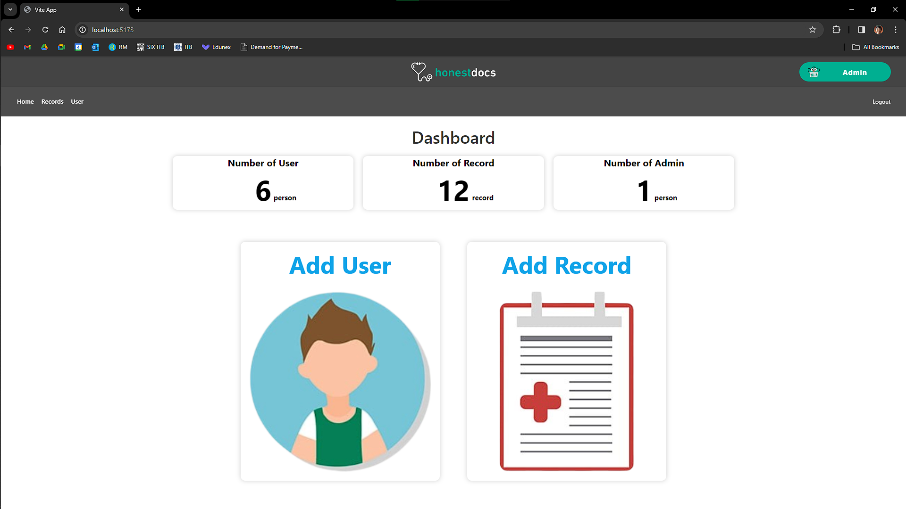
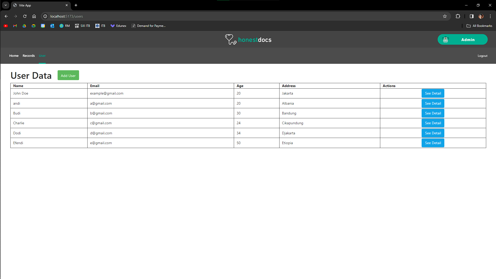
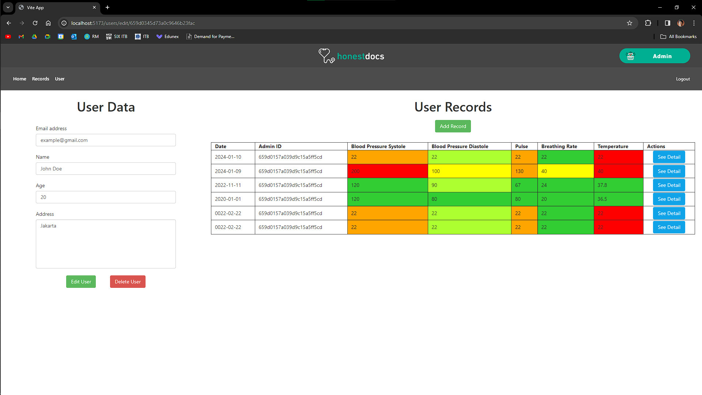
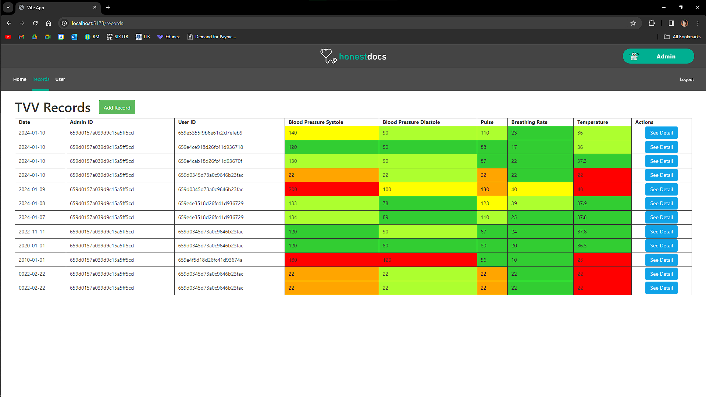
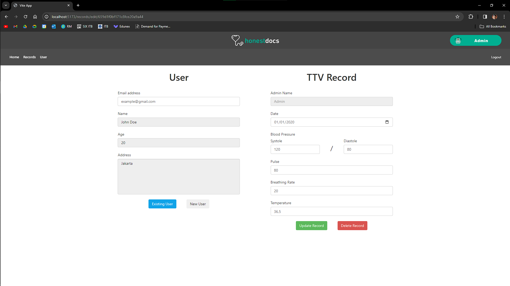

# TTV-Web
Simple TTV Web With Vue, Express, Mongo, and Docker

## Requirements
1. Git
2. Docker

## How to run
1. Clone this repository
```sh
git clone https://github.com/bryanbernigen/TTV-Web
```
2. Go to the directory
```sh
cd TTV-Web
```
3. Add .env file at /BE directory
4. Fill the .env file
```sh
MONGO_URI=<YOUR MONGO DB CONNECTION URI
PORT=5000
JWT_SECRET=<YOUR JWT SECRET>
```
5. Run docker-compose
```sh
docker-compose up
```
6. Open http://localhost:5173 in your browser for the frontend
7. Open http://localhost:5000/api-docs in your browser for the backend

## Important Notes
1. You Could not Register using the frontend, you need to register using the backend API
```
1. Open then backend API docs at http://localhost:5000/api-docs
2. Click the POST /admin/register in the Auth section
3. Click the Try it out button
4. Fill the form with your data
5. Click the Execute button
```

## Features
1. Api Docs


2. Login


3. Dashboard


4. User Management


5. User Detail


6. Record Management


7. Record Detail


## Author
|Name|Contact|Github|LinkedIn|
|----|-------|------|--------|
|Bryan Bernigen | bryanbernigen@gmail.com|<a href="https://www.github.com/bryanbernigen">@bryanbernigen</a>|<a href="https://www.linkedin.com/in/bryanbernigen">bryanbernigen</a>|